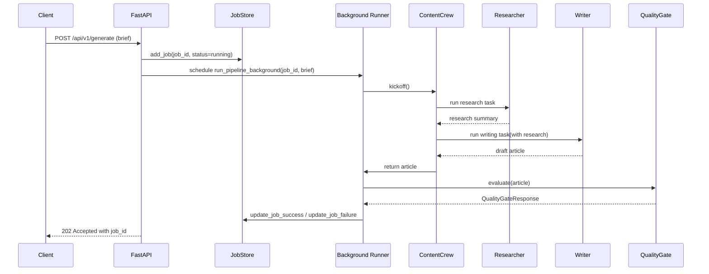
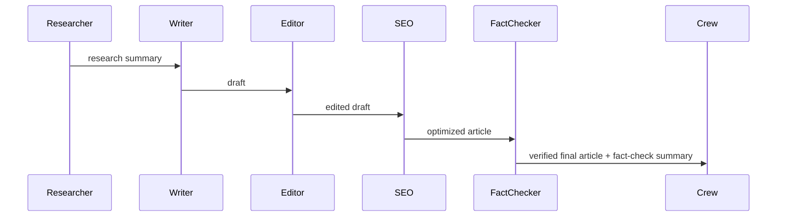

# CrewAI Content Production System — Complete Project Overview

> A comprehensive, highly verbose guide that explains the architecture, workflows, agents, tools, pipelines, business logic, features, utilities, work completed, known gaps, and recommended next steps for the CrewAI Content Production System project.

---

## Table of Contents

- Project summary
- Goals & success criteria
- High-level architecture (diagram + description)
- Pipeline & workflows (detailed sequence diagrams)
- Agents, Tasks & Crews — responsibilities and internals
- Tools & utilities — descriptions and integration points
- Quality Gate — scoring, thresholds, and logic
- API surface and data models
- Job lifecycle, persistence, and monitoring
- Logging, observability & testing
- Frontend (current state & integration plan)
- Security, privacy & operational concerns
- Work completed (phase 1) — file-level references
- Gaps, TODOs, and recommended roadmap
- Appendices: file references, run steps, environment

---

## Project summary

CrewAI Content Production System is an autonomous AI content agency prototype designed to run multi-agent content production pipelines. The system composes a configurable crew of specialized agents (Researcher, Writer, Editor, SEO, Fact Checker) to produce publication-ready articles from a user brief.

Primary characteristics:

- Modular agent architecture using CrewAI abstractions (`crewai.Agent`, `crewai.Task`, `crewai.Crew`).
- FastAPI backend exposing a minimal API to kick off pipelines and monitor jobs.
- Tool wrappers for external services (Tavily Search, grammar/SEO/plagiarism checks) used by agents and the Quality Gate.
- An automated Quality Gate that validates content before it's marked successful.

This document synthesizes the codebase, runtime behavior, design rationale, and recommended improvements.

## Goals & success criteria

- Produce accurate, publication-ready articles from a user brief with minimal human oversight.
- Keep agent roles narrow and auditable (research → write → edit → seo → verify).
- Provide observability (job status, logs, SSE stream) and automated technical documentation.
- Fail early and report clear, actionable reasons when content does not meet quality requirements.

Success criteria for Phase 1 (current):

- Researcher + Writer pipeline runs reliably and returns an article.
- REST endpoint `POST /api/v1/generate` accepts briefs and returns job ids.
- Quality Gate is pluggable and can evaluate outputs with grammar/SEO/plagiarism tools.

## High-level architecture

The system is implemented as a single backend service with a future frontend UI. The components are:

- FastAPI application (`backend/main.py`) — HTTP endpoints and startup hooks.
- Crews & Tasks (`backend/crews`, `backend/tasks`) — pipeline wiring.
- Agents (`backend/agents`) — modular agents with `get_llm()` LLM config.
- Tools (`backend/tools`) — wrappers for external services.
- Utilities (`backend/utils`) — logging, job store, doc generator, quality gate.

Architecture diagram (component view):

```mermaid
graph TD
  subgraph Backend
    A[FastAPI API] --> B[Job Store]
    A --> C[Content Crew Runner]
    C --> D[Researcher Agent]
    C --> E[Writer Agent]
    C --> F[Editor Agent]
    C --> G[SEO Agent]
    C --> H[Fact Checker Agent]
  end

  D --> T1[Tavily Search Tool]
  H --> T1
  F --> T2[Grammar Tool]
  G --> T3[SEO Analyzer]
  A --> L[Doc Generator]
  A --> Logs[Log Stream (SSE)]

  style Backend fill:#f9f,stroke:#333,stroke-width:1px
```

Notes:

- Agents communicate via CrewAI process orchestration — outputs from one Task are fed into the next Task's input.
- Tools are either CrewAI-native (CrewAITavilyTool) or local wrappers (`backend/tools/tavily_tool.py`) used for direct, non-agent use (e.g., tests).
- `utils/doc_generator.py` introspects the FastAPI app and tools to produce `docs/architecture_and_api.md` automatically on startup.

## Pipeline & workflows

Two workflow views are useful: (1) job lifecycle (API → background runner → job store); (2) in-crew agent sequence.

Sequence: job lifecycle



Sequence: in-crew agent flow (high level)



## Agents, Tasks & Crews — responsibilities and internals

Files to inspect:

- Project crew entry: [backend/crews/content_crew.py](backend/crews/content_crew.py#L1-L200)
- Task definitions: [backend/tasks/content_tasks.py](backend/tasks/content_tasks.py#L1-L300)
- Agent factories: [backend/agents/\*.py](backend/agents/)

Agent design patterns observed:

- Each agent is a factory function that returns a configured `crewai.Agent` object (`build_researcher_agent`, `build_writer_agent`, etc.). This keeps configuration local and testable.
- Agents use `get_llm()` from `utils.helpers` to centralize LLM configuration (model, temperature, credentials).
- Tools: researcher and fact-checker make use of Tavily search via CrewAI tool wrappers; other agents currently operate without external tools (operate on given text).

Agent behavior flags (common across agents):

- `verbose=True` — internal reasoning and logs exposed when running.
- `allow_delegation=False` — agents perform tasks directly rather than delegating.
- `max_iter` — guards against runaway reasoning loops.

Task patterns:

- Tasks declare a `description` (instructions), `expected_output`, and the `agent` assigned to them.
- Tasks are used to separate the _role_ (agent) from the _work_ (task). This allows reusing agents across tasks in the future.

Crew behavior:

- `build_content_crew()` composes tasks into a `Crew` with `Process.sequential` which guarantees strict order: research → write → edit → seo → fact-check.

## Tools & utilities — descriptions and integration points

Key tool wrappers live in `backend/tools`:

- `tavily_tool.py` — application-level wrapper around the Tavily Search API for manual use and tests.
- `grammar_tool.py` — grammar checking wrapper (used by quality gate); TODO in repo indicates some parts may be placeholders.
- `seo_tool.py` — SEO analyzer used by quality gate.
- `plagiarism_tool.py` — semantic plagiarism detector using sentence-transformers for similarity.

Utilities:

- `utils/logger.py` — sets up Loguru logging and provides listener registration for SSE log streaming.
- `utils/job_store.py` — in-memory job store (JobBrief, add/update/list jobs). This is intended for Phase 1; recommend replacing with persistent store (Postgres) in Phase 2.
- `utils/doc_generator.py` — introspects FastAPI routes, tool classes, and Quality Gate to auto-generate `docs/architecture_and_api.md` on startup.

## Quality Gate — scoring, thresholds, and logic

The Quality Gate is implemented in `backend/utils/quality_gate.py` and is central to determining whether an article is returned as successful. Key points:

- Checks performed: Grammar (via `GrammarCheckTool`), SEO (via `SEOKeywordAnalyzer`), Plagiarism (via `PlagiarismDetector`).
- Configurable thresholds: `max_grammar_errors` (default 5), `min_seo_score` (default 70.0), `max_plagiarism_pct` (default 15.0).
- Composite score computation:
  - With reference docs: Weights = Grammar 30% | SEO 40% | Plagiarism 30%
  - Without reference docs: Weights = Grammar 40% | SEO 60% (plagiarism skipped)

Score computation details:

- Grammar score component = max(0, 100 - 10 \* grammar_errors)
- Plagiarism score component = 100 - plagiarism_pct
- Overall score is a weighted sum and rounded to 1 decimal place.

Return type: `QualityGateResponse` dataclass containing boolean pass/fail, subcomponent pass flags, numeric scores, and reasons.

Operational notes & recommendations:

- Plagiarism checks are expensive and require reference docs. If you plan to enable this in production, ensure you have an indexed dataset and a vector DB (e.g. Chroma, Lancedb) to compare against.
- Grammar tooling should be tolerant of model idiosyncrasies — treat grammar scores as suggestions when combined with other signals.

## API surface and data models

Primary endpoints (FastAPI router at `backend/api/routes.py`):

- `POST /api/v1/generate` — accept `ContentBriefRequest`, register job, schedule background pipeline, return job id and status (`running`). See [backend/api/routes.py](backend/api/routes.py#L1-L300).
- `GET /api/v1/jobs` — list jobs (from in-memory job store).
- `GET /api/v1/jobs/{job_id}` — get job details and final article if completed.
- `GET /api/v1/docs` — fetch current generated documentation file; auto-generates if missing.
- `POST /api/v1/docs/generate` — manually trigger doc regeneration.
- `GET /api/v1/logs/stream` — stream real-time log lines via SSE.
- `GET /api/v1/health` — simple health check.

Data models / schemas are defined in `backend/schemas`:

- `ContentBriefRequest` — input brief (topic, tone, word_count, audience, optional seo_keywords, reference_docs).
- `ContentResponse` — job response model containing job id, status, topic, created_at, and later expanded data on completion.

File references:

- API routes: [backend/api/routes.py](backend/api/routes.py#L1-L300)
- Schemas: [backend/schemas/content_schema.py](backend/schemas/content_schema.py#L1-L200) and [backend/schemas/response_schema.py](backend/schemas/response_schema.py#L1-L200)

## Job lifecycle, persistence, and monitoring

Job lifecycle steps:

1. `generate_content()` creates a `job_id` and registers a `JobBrief` in the in-memory `job_store`.
2. Work is scheduled via FastAPI `BackgroundTasks` calling `run_pipeline_background()`.
3. Pipeline runs synchronously inside a thread pool executor and returns `article, gate_res`.
4. `job_store.update_job_success()` or `job_store.update_job_failure()` is called with results.
5. Clients poll `GET /api/v1/jobs/{job_id}` to view updated status and article.

Observability:

- SSE stream provided at `/api/v1/logs/stream` exposes live logs (Loguru). Inspect `utils/logger.py` for listener logic.
- `utils/doc_generator.py` auto-generates documentation to keep API docs in-sync.

Persistence recommendations:

- Replace in-memory `job_store` with PostgreSQL (or SQLite for small scale) and add migrations (Alembic already present in other repos; consider adding). Store articles, timestamps, quality scores, agent outputs, and references.
- Add a background worker queue (Redis + RQ or Celery) if concurrency and retry semantics become important.

## Logging, observability & testing

Logging:

- `utils/logger.py` configures Loguru and exposes a listener pattern for SSE streams. Logs are written to `backend/logs/app.log` (rotating JSON recommended).

Testing:

- Project has unit test stubs under `backend/tests` (`test_doc_generator.py`, `test_api.py`, `test_tavily.py`, `test_seo.py`, `test_plagiarism.py`, `test_job_store.py`, `test_grammar.py`, `test_quality_gate.py`). Use `pytest` to run tests. Ensure tests are isolated from external API calls (mock Tavily/OpenAI).

CI recommendations:

- Add GitHub Actions to run lint, unit tests, and generate docs. Prefer matrix for Python versions and run smoke tests against a test server with mocked external APIs.

## Frontend (current state & integration plan)

Current state:

- A Vite + React scaffold exists under `frontend/` with minimal README and assets. No production UI components or API integration yet.

Integration plan (Phase 2):

- Build `ContentBriefForm` component to POST to `/api/v1/generate` and show `job_id`.
- Build `WorkflowStatus` and `JobView` to poll `GET /api/v1/jobs/{job_id}` and subscribe to SSE logs for live updates.
- `ArticleDisplay` to render generated article and fact-check summary.

Useful frontend tech:

- `axios` for HTTP requests, `EventSource` for SSE logs, and a small state manager (React context) for job states.

## Security, privacy & operational concerns

- Secrets: API keys must be stored in environment variables (`.env`) and never committed. `.env.example` is present in `backend/.env.example`.
- API rate limits & costs: LLM (OpenAI/Gemini) usage and Tavily calls are billable; implement usage quotas and exponential backoff.
- PII & plagiarism: When running plagiarism checks or searching content, ensure privacy of submitted briefs.

## Work completed (Phase 1) — file-level summary

- Core README: [README.MD](README.MD#L1-L200)
- API & server boot: [backend/main.py](backend/main.py#L1-L200) and [backend/api/routes.py](backend/api/routes.py#L1-L400)
- Crew & tasks composition: [backend/crews/content_crew.py](backend/crews/content_crew.py#L1-L200) and [backend/tasks/content_tasks.py](backend/tasks/content_tasks.py#L1-L300)
- Agent factories: [backend/agents/\*.py](backend/agents/)
- Quality Gate & docs generator: [backend/utils/quality_gate.py](backend/utils/quality_gate.py#L1-L300), [backend/utils/doc_generator.py](backend/utils/doc_generator.py#L1-L300)
- Tool wrappers and tests: [backend/tools/\*.py](backend/tools/), [backend/tests/](backend/tests/)

The system already auto-generates `docs/architecture_and_api.md` on startup.

## Gaps, TODOs, and recommended roadmap

Immediate (short-term):

- Fix virtual environment invocation and ensure local dev startup uses `venv/bin/uvicorn` consistently (README shows mixed commands).
- Add mocking for Tavily & LLM in tests to make CI reliable.
- Harden `utils/job_store.py` and add persistence.

Near-term (Phase 1 → Phase 2):

- Implement `tools/grammar_tool.py`, `tools/seo_tool.py`, `tools/plagiarism_tool.py` fully (if not complete).
- Integrate Editor → SEO → Fact Checker in actual runs (current README shows Phase 1 only runs Researcher → Writer).
- Add retry/backoff semantics and job-level timeouts to background runner.

Medium-term (Phase 2):

- Frontend dashboard with job timeline, SSE logs, and article viewer.
- Add a task queue (Redis + RQ / Celery) for scale and retries.
- Introduce a PostgreSQL DB for jobs and user accounts; optionally a vector DB for reference docs and semantic search.

Long-term (Phase 3):

- Streaming pipeline for real-time article generation to frontend (server-sent events or websockets from agent output).
- Human-in-the-loop review UI and feedback agent to incorporate edits.

## Operational run steps (developer quick start)

1. Backend venv & install

```bash
cd microProjects/crewai-content-production-system/backend
python3 -m venv venv
source venv/bin/activate
pip install -r requirements.txt
cp .env.example .env
# set OPENAI_API_KEY, TAVILY keys in .env
PYTHONPATH=. venv/bin/uvicorn main:app --reload --port 8000
```

2. Try API

```bash
curl -X POST "http://localhost:8000/api/v1/generate" -H "Content-Type: application/json" \
  -d '{"topic":"How AI transforms retail","tone":"professional","word_count":600}'
```

3. Generate docs (if missing):

```bash
curl -X POST "http://localhost:8000/api/v1/docs/generate"
```

## Risk assessment & mitigation

- Cost risk: LLM calls are expensive. Mitigation: caching, sampling, lower-cost models, and quota enforcement.
- Hallucination risk: models may invent facts. Mitigation: enforce Fact Checker agent, require `reference_docs` for sensitive topics, and surface provenance for claims.
- Safety & compliance: filter outputs for policy violations; add a `moderation` step if needed.

## Appendix: Useful file links

- [Project README](README.MD)
- [Auto-generated architecture](docs/architecture_and_api.md)
- [Backend main](backend/main.py#L1-L200)
- [API routes](backend/api/routes.py#L1-L400)
- [Content crew](backend/crews/content_crew.py#L1-L200)
- [Task definitions](backend/tasks/content_tasks.py#L1-L300)
- [Agents folder](backend/agents/)
- [Tools folder](backend/tools/)
- [Quality Gate](backend/utils/quality_gate.py#L1-L300)
- [Doc generator](backend/utils/doc_generator.py#L1-L300)

---

If you want, I can:

- Generate a condensed `README`-style doc for non-technical stakeholders.
- Scaffold the frontend components to integrate with the API (ContentBriefForm, JobStatus, ArticleViewer).
- Convert `job_store` to a simple SQLite-backed persistence layer and add migration scripts.

Tell me which of the follow-ups you'd like me to implement next.
